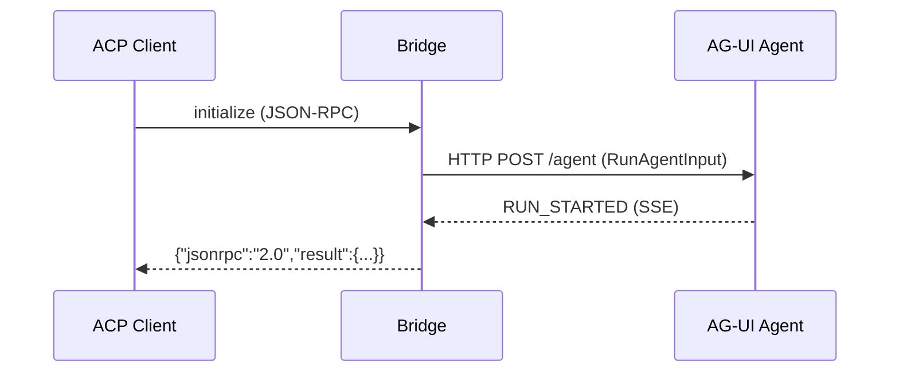
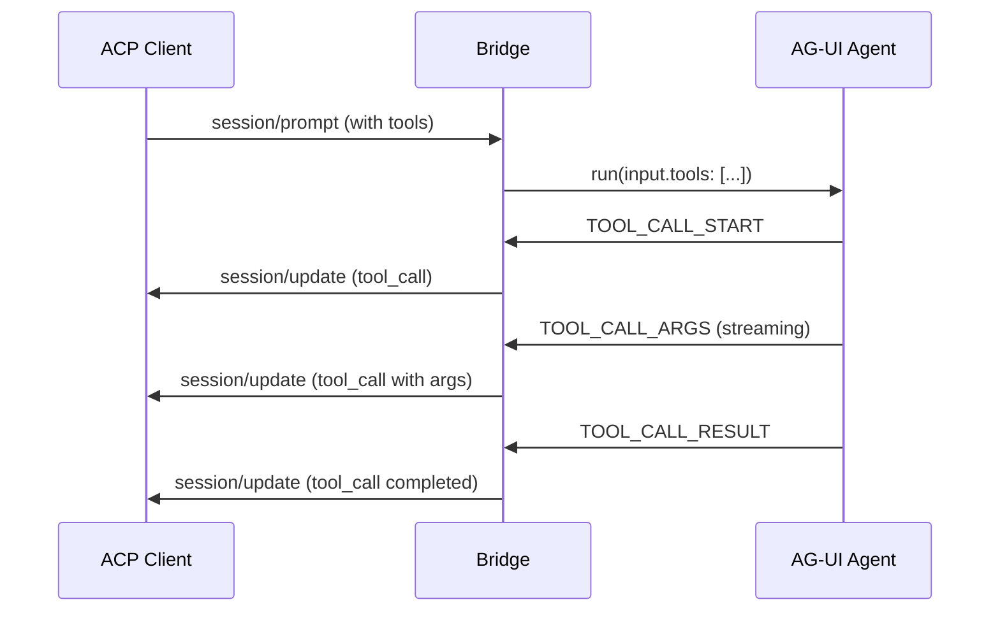

# ACP to AG-UI Bridge Specification

> Technical specification for bridging Agent Client Protocol (ACP) to Agent User Interaction Protocol (AG-UI)

## Executive Summary

The **ACP to AG-UI Bridge** enables ACP-compatible clients (IDEs, editors) to connect to AG-UI-compatible agents and servers. It translates ACP's JSON-RPC message flow into AG-UI's event-driven streaming architecture, allowing ACP clients to leverage the broader AG-UI ecosystem.

**Direction:** `ACP Client → Bridge → AG-UI Agent`

---

## Feasibility Analysis

### Technical Feasibility: **High**

The bridge is technically feasible due to:

1. **Message Format Compatibility**
   - ACP uses JSON-RPC 2.0 (request-response)
   - AG-UI uses JSON events (streaming)
   - Both are JSON-based, enabling straightforward transformation

2. **Conceptual Mapping**
   - ACP `session/prompt` maps to AG-UI `run(input)` 
   - ACP `session/update` notifications map to AG-UI lifecycle events
   - ACP tool calls map to AG-UI tool call events

3. **Existing Infrastructure**
   - AG-UI already supports HTTP/SSE and HTTP/Binary transports
   - Standard HTTP client libraries can be reused
   - No protocol modification required

### Implementation Complexity: **Medium**

| Component | Complexity | Notes |
|-----------|------------|-------|
| Message parsing | Low | JSON-RPC to JSON event |
| State management | Medium | Session state translation |
| Tool handling | Medium | Bidirectional tool call flow |
| Authentication | Low | Pass-through or map to AG-UI auth |
| Streaming | Medium | ACP notifications → SSE events |

### Risks and Mitigations

| Risk | Mitigation |
|------|------------|
| ACP features not in AG-UI | Graceful degradation, feature flags |
| Latency from transformation | Async, buffered streaming |
| Session lifecycle mismatch | Explicit state machine mapping |
| Tool call async handling | Promise-based result mapping |

---

## Goals

### Primary Goals

1. **Protocol Interoperability**
   - Enable ACP clients to communicate with AG-UI agents
   - Preserve all functional capabilities during translation

2. **Minimal Latency**
   - Stream events in real-time without buffering
   - Handle bidirectional tool calls efficiently

3. **Transparent Operation**
   - ACP clients should not require modification
   - Bridge should be invisible to both client and agent

### Secondary Goals

1. **Feature Parity**
   - Support all ACP message types (initialize, session/*, tools)
   - Map ACP capabilities to AG-UI equivalents

2. **Error Propagation**
   - Translate errors accurately between protocols
   - Preserve error codes and messages

3. **Extensibility**
   - Support custom AG-UI events
   - Allow protocol extensions

---

## Features

### Core Features

#### 1. Protocol Handshake Translation



**ACP Input:**
```json
{
  "jsonrpc": "2.0",
  "id": 0,
  "method": "initialize",
  "params": {
    "protocolVersion": 1,
    "clientCapabilities": {...},
    "clientInfo": {"name": "zed", "version": "1.0"}
  }
}
```

**AG-UI Output:** HTTP request to agent endpoint (no AG-UI equivalent for initialize - handled via HTTP auth headers)

#### 2. Session Management

| ACP Method | AG-UI Equivalent | Translation |
|------------|-------------------|--------------|
| `session/new` | Implicit in `run()` | Thread ID generated |
| `session/load` | Thread ID in input | Map sessionId to threadId |
| `session/prompt` | `run()` with messages | Primary translation target |

#### 3. Message Streaming

**ACP → AG-UI:**

```typescript
// ACP notification
{
  "jsonrpc": "2.0",
  "method": "session/update",
  "params": {
    "sessionId": "sess_123",
    "update": {
      "sessionUpdate": "agent_message_chunk",
      "content": { "type": "text", "text": "Hello" }
    }
  }
}

// AG-UI events (streamed)
{ "type": "TEXT_MESSAGE_START", "messageId": "msg_1", "role": "assistant" }
{ "type": "TEXT_MESSAGE_CONTENT", "messageId": "msg_1", "delta": "Hello" }
{ "type": "TEXT_MESSAGE_END", "messageId": "msg_1" }
```

#### 4. Tool Call Handling



**Mapping:**

| AG-UI Event | ACP Session Update |
|-------------|-------------------|
| `TOOL_CALL_START` | `sessionUpdate: "tool_call"` |
| `TOOL_CALL_ARGS` | Append to tool call arguments |
| `TOOL_CALL_END` | Mark tool call ready |
| `TOOL_CALL_RESULT` | `sessionUpdate: "tool_call_update"` with content |

#### 5. State Synchronization

```typescript
// AG-UI state events
{ "type": "STATE_SNAPSHOT", "snapshot": {...} }
{ "type": "STATE_DELTA", "delta": [...] }

// ACP: No direct equivalent - could emit as session updates
{
  "method": "session/update",
  "params": {
    "sessionUpdate": "state_snapshot",
    "state": {...}
  }
}
```

### Advanced Features

#### 1. Capability Negotiation

```typescript
interface BridgeCapabilities {
  // AG-UI side
  agentEndpoint: string;
  supportsBinary: boolean;
  supportsSSE: boolean;
  
  // ACP side (advertised to client)
  fs: { readTextFile: boolean; writeTextFile: boolean };
  terminal: boolean;
  loadSession: boolean;
}
```

#### 2. Authentication Bridge

```typescript
// ACP auth methods → AG-UI HTTP headers
const authMethodsToHeaders = (methods: AuthMethod[]): Record<string, string> => {
  const headers: Record<string, string> = {};
  
  if (methods.some(m => m.type === 'env_var')) {
    // Extract env vars and add to request
    headers['X-Env-Vars'] = JSON.stringify(methods.filter(m => m.type === 'env_var'));
  }
  
  return headers;
};
```

#### 3. Progress Reporting

- Translate AG-UI `ACTIVITY_SNAPSHOT`/`ACTIVITY_DELTA` to ACP `session/update` with custom content
- Map AG-UI `REASONING_*` events to ACP `session/update` for visibility

---

## Architecture

### Component Diagram

```
┌──────────────┐     ┌─────────────────┐     ┌──────────────┐
│  ACP Client  │────▶│  ACP-AGUI Bridge│────▶│ AG-UI Agent │
│  (JSON-RPC)  │◀────│                 │◀────│  (Events)   │
└──────────────┘     └─────────────────┘     └──────────────┘
                           │
                    ┌──────┴──────┐
                    │  Core Logic │
                    ├─────────────┤
                    │ • Translator│
                    │ • Session   │
                    │ • State     │
                    │ • Events    │
                    └─────────────┘
```

### Data Flow

```typescript
class AcpToAguiBridge {
  private agentUrl: string;
  private sessions: Map<string, SessionState>;
  
  async handleACPMessage(msg: JsonRpcMessage): Promise<JsonRpcResponse | void> {
    switch (msg.method) {
      case 'initialize':
        return this.handleInitialize(msg);
      case 'session/new':
        return this.handleSessionNew(msg);
      case 'session/prompt':
        return this.handlePrompt(msg);
      case 'session/update':
        // Notifications - potentially forward to agent
        return this.handleUpdate(msg);
      case 'session/cancel':
        return this.handleCancel(msg);
    }
  }
  
  private async handlePrompt(msg: JsonRpcMessage): Promise<JsonRpcResponse> {
    const { sessionId, prompt } = msg.params;
    
    // Build RunAgentInput from ACP prompt
    const input = this.acpPromptToAguiInput(prompt);
    input.threadId = sessionId;
    input.runId = generateRunId();
    
    // Stream events back to ACP client
    const events = await this.runAgentStream(input);
    
    // Transform and send as session/update notifications
    for await (const event of events) {
      await this.emitAcpUpdate(sessionId, event);
    }
    
    return { jsonrpc: '2.0', id: msg.id, result: { stopReason: 'end_turn' } };
  }
  
  private acpPromptToAguiInput(prompt: ContentBlock[]): RunAgentInput {
    return {
      messages: prompt.map(block => ({
        id: generateMessageId(),
        role: 'user',
        content: block.text ?? ''
      })),
      tools: [], // TODO: Extract from agent capabilities
      context: [],
      state: {}
    };
  }
}
```

---

## Configuration

```typescript
interface BridgeConfig {
  // Agent connection
  agentUrl: string;           // AG-UI agent endpoint
  agentAuth?: string;         // Auth token/header
  
  // ACP defaults
  defaultCapabilities: ClientCapabilities;
  defaultCwd: string;
  
  // Behavior
  streamToolCalls: boolean;   // Stream tool call args
  includeReasoning: boolean;  // Pass reasoning events
  stateSyncMode: 'snapshot' | 'delta' | 'none';
  
  // Timeouts
  requestTimeout: number;     // ms
  streamIdleTimeout: number;  // ms
}
```

---

## Limitations

| Feature | Status | Notes |
|---------|--------|-------|
| Binary transport | Partial | SSE only in v1 |
| MCP server config | Limited | AG-UI lacks MCP concept |
| Session modes | Not mapped | ACP-specific feature |
| Terminal handling | Not supported | Requires ACP client capability |

---

## References

- [ACP Protocol](./acp.md)
- [AG-UI Protocol](./agui.md)
- [AG-UI Server Implementation](https://docs.ag-ui.com/quickstart/server.md)
- [ACP Registry](./acp-registry.md)