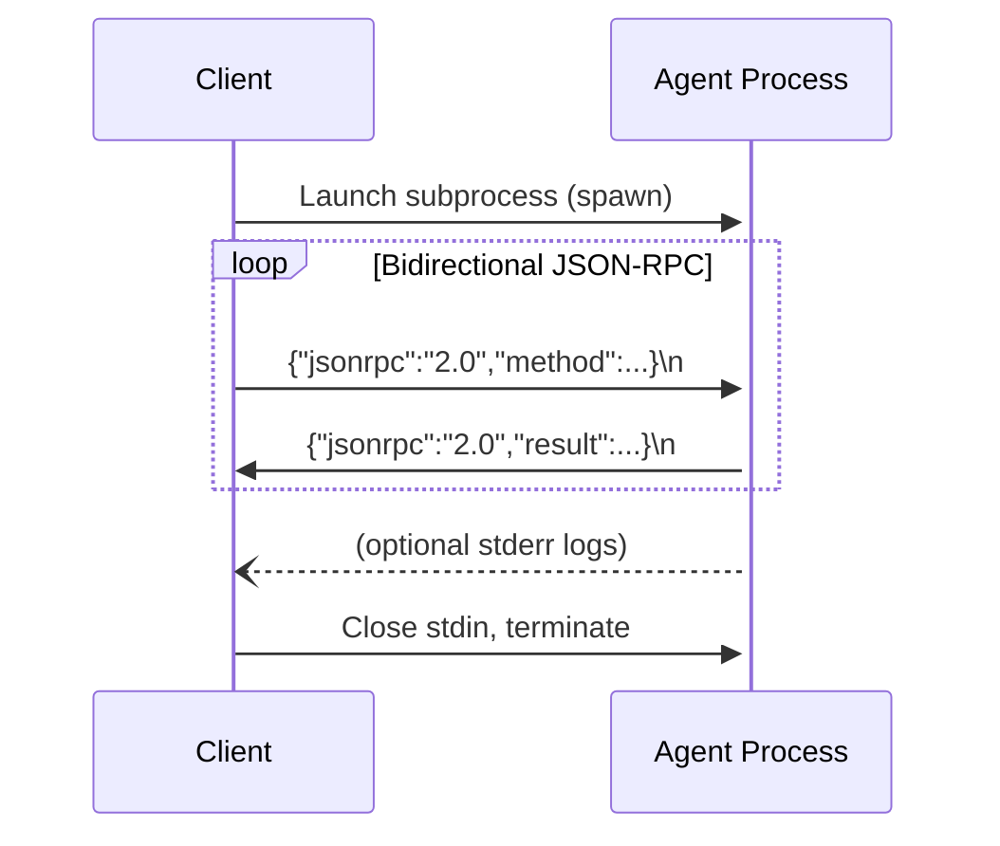
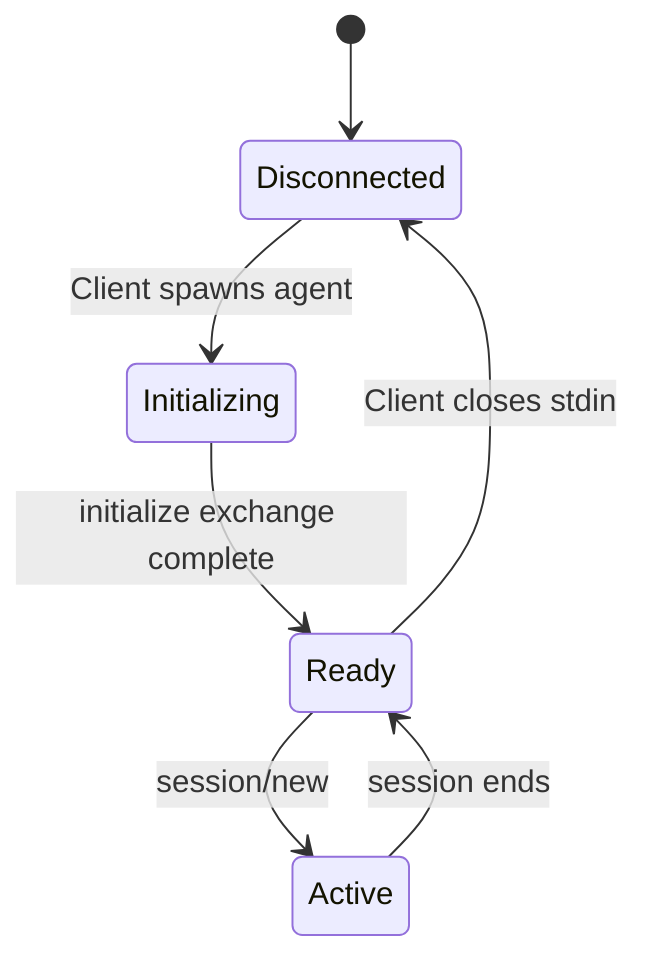
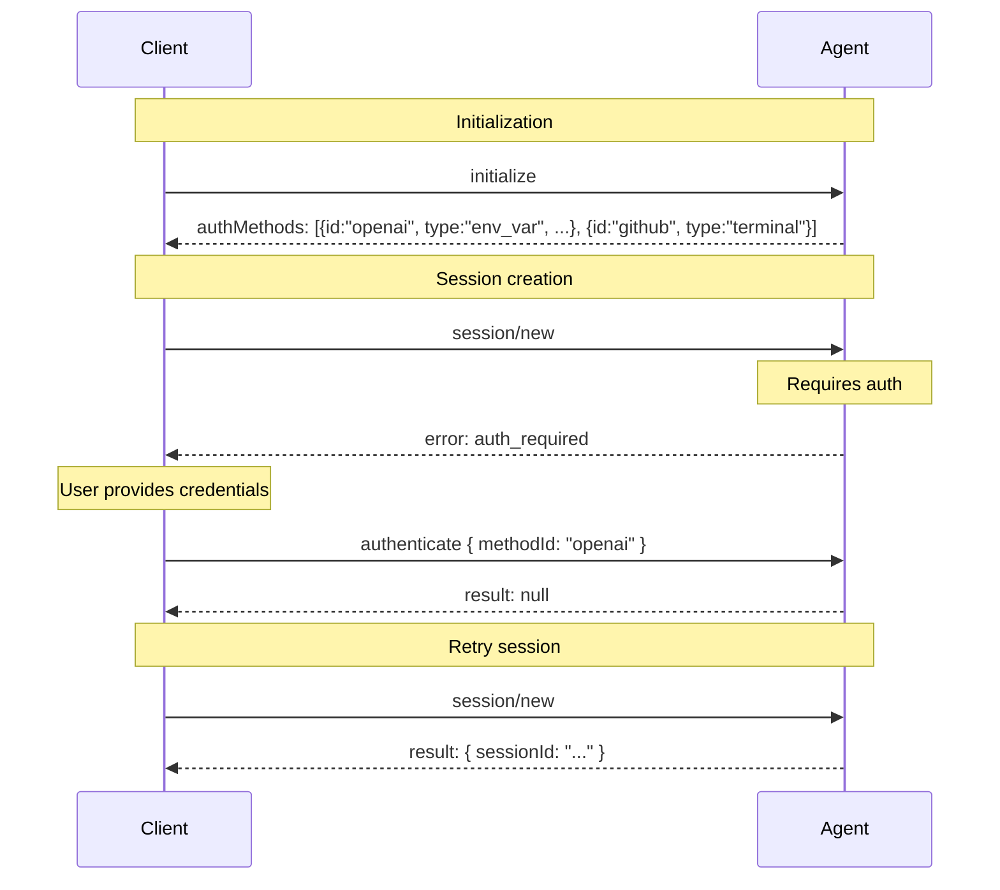
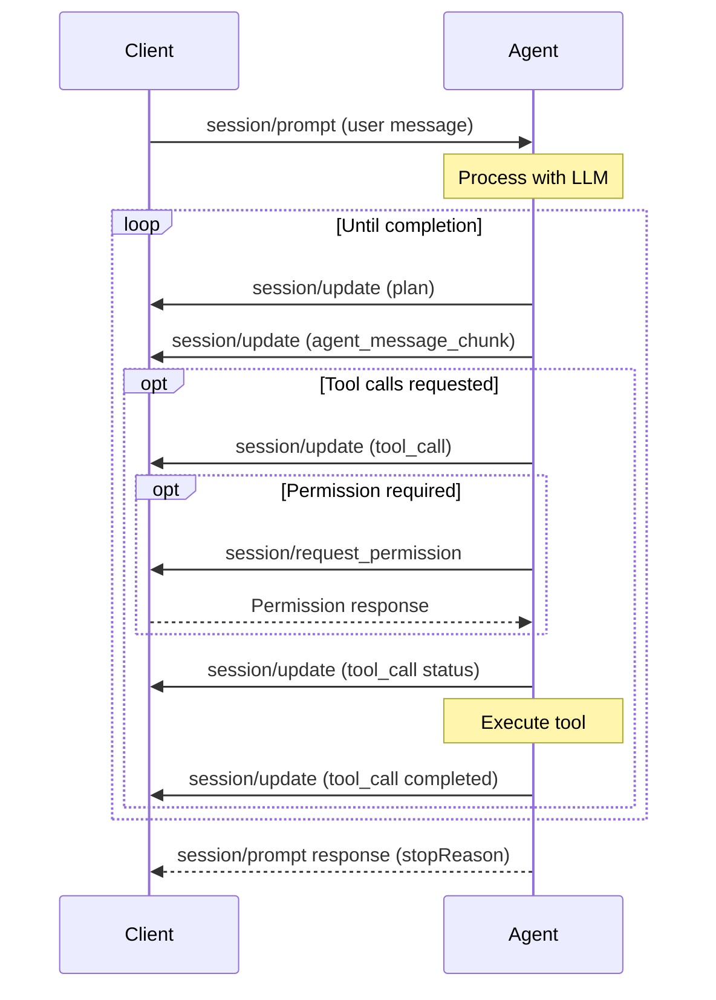

# Agent Client Protocol (ACP)

> A protocol for communication between AI agents and client applications (typically code editors/IDEs)

**Website:** https://agentclientprotocol.com

## Overview

The Agent Client Protocol (ACP) defines a standard interface for communication between AI agents and client applications. It is designed to be:

- **MCP-friendly**: Built on JSON-RPC, reusing MCP types where possible
- **UX-first**: Designed for UX challenges of interacting with AI agents
- **Trusted**: Works with trusted code editors where users have control over agent tool calls

## Architecture

### Communication Model

ACP uses [JSON-RPC 2.0](https://www.jsonrpc.org/specification) with two message types:
- **Methods**: Request-response pairs expecting a result or error
- **Notifications**: One-way messages that don't expect a response

### Components

```
┌─────────────────┐     ┌─────────────────┐
│     Client      │────▶│      Agent      │
│  (Code Editor)  │◀────│  (Sub-process)  │
└─────────────────┘     └─────────────────┘
```

- **Agent**: A program that uses generative AI to autonomously modify code, typically runs as a subprocess
- **Client**: Typically a code editor (IDE) that manages the environment, handles user interactions, and controls access to resources

## Transport Mechanisms

### stdio (Standard)

The primary and **required** transport mechanism:

**Connection Setup:**
- Client launches the agent as a subprocess
- Agent reads JSON-RPC from stdin, writes to stdout
- Messages are newline-delimited (`\n`)
- stderr is used for logging (optional, client may capture/ignore)

**Message Format:**
- Each message is a complete JSON-RPC object
- Messages MUST NOT contain embedded newlines
- Agent MUST NOT write non-ACP content to stdout
- Client MUST NOT write non-ACP content to agent's stdin



**Process Lifecycle:**
1. Client spawns agent subprocess
2. Client sends `initialize` method on stdin
3. Agent responds on stdout
4. Client sends `session/new` to create session
5. ... interaction ...
6. Client closes stdin to signal termination
7. Agent process exits

### Streamable HTTP (Draft)

*In discussion, draft proposal in progress.*

### Custom Transports

Agents and clients MAY implement additional transport mechanisms. Custom transports MUST:
- Preserve JSON-RPC message format
- Maintain lifecycle requirements
- Document connection establishment and message patterns

## Transport Connection Details

### Message Framing

**stdio transport:**
```
{"jsonrpc":"2.0","id":1,"method":"initialize","params":{...}}\n
{"jsonrpc":"2.0","id":0,"result":{"protocolVersion":1,...}}\n
```

Each JSON-RPC message is a single line. No batching or chunking.

### Connection Lifecycle



### Transport Errors

**stdio specific errors:**
- Process exit before response: Treat as connection failure
- Invalid JSON received: Parse error, terminate connection
- Missing newline: Message framing error

**Handling:**
- Agents MUST handle stdin close gracefully
- Clients SHOULD handle agent process crash
- stderr output may contain diagnostic information

## Initialization

Before any session, Clients **MUST** initialize the connection:

```json
// Client -> Agent
{
  "jsonrpc": "2.0",
  "id": 0,
  "method": "initialize",
  "params": {
    "protocolVersion": 1,
    "clientCapabilities": {
      "fs": { "readTextFile": true, "writeTextFile": true },
      "terminal": true
    },
    "clientInfo": { "name": "my-client", "version": "1.0.0" }
  }
}

// Agent response
{
  "jsonrpc": "2.0",
  "id": 0,
  "result": {
    "protocolVersion": 1,
    "agentCapabilities": {
      "loadSession": true,
      "promptCapabilities": { "image": true, "audio": true },
      "mcpCapabilities": { "http": true }
    },
    "agentInfo": { "name": "my-agent", "version": "1.0.0" },
    "authMethods": [
      { "id": "openai", "name": "OpenAI API Key", "type": "env_var", "vars": [{ "name": "OPENAI_API_KEY" }], "link": "https://platform.openai.com/api-keys" },
      { "id": "github", "name": "GitHub", "type": "terminal", "description": "Login via terminal", "args": ["--login"] }
    ]
  }
}
```

## Authentication

ACP supports multiple authentication mechanisms that agents can advertise during initialization. Clients use this information to present appropriate authentication UI to users.

### Authentication Methods

Agents advertise available authentication methods in the `authMethods` field of the `initialize` response:

```json
{
  "authMethods": [
    { "id": "agent", "name": "Agent" },
    { "id": "openai", "name": "OpenAI API Key", "type": "env_var", "vars": [...], "link": "..." },
    { "id": "github", "name": "GitHub", "type": "terminal", "args": ["--login"] }
  ]
}
```

#### Agent Auth (Default)

The agent handles authentication itself. This is the default when no `type` is specified:

```json
{
  "id": "agent",
  "name": "Agent",
  "description": "Authenticate through agent"
}
```

The client invokes the authenticate method and the agent performs any needed setup (opening browser, running commands, etc.).

#### Environment Variable Auth

The user provides credentials that the client passes to the agent as environment variables:

```json
{
  "id": "openai",
  "name": "OpenAI API Key",
  "type": "env_var",
  "vars": [
    { "name": "OPENAI_API_KEY", "label": "API Key", "secret": true }
  ],
  "link": "https://platform.openai.com/api-keys"
}
```

**Fields:**
- `vars` (required): Array of environment variables
- `link` (optional): URL where user can obtain credentials

**EnvVar fields:**
- `name` (required): Environment variable name
- `label` (optional): Human-readable label for UI
- `secret` (optional, default: true): Whether to use password input
- `optional` (optional, default: false): Whether variable is optional

**Multi-variable example:**
```json
{
  "id": "azure-openai",
  "name": "Azure OpenAI",
  "type": "env_var",
  "vars": [
    { "name": "AZURE_OPENAI_API_KEY", "label": "API Key", "secret": true },
    { "name": "AZURE_OPENAI_ENDPOINT", "label": "Endpoint URL", "secret": false },
    { "name": "AZURE_OPENAI_API_VERSION", "label": "API Version", "secret": false, "optional": true }
  ],
  "link": "https://portal.azure.com"
}
```

#### Terminal Auth

The client runs an interactive terminal for user login:

```json
{
  "id": "github",
  "name": "GitHub",
  "type": "terminal",
  "description": "Login via terminal",
  "args": ["--setup"],
  "env": { "VAR1": "value1" }
}
```

**Fields:**
- `args` (optional): Additional arguments for login command
- `env` (optional): Additional environment variables

The client invokes the same agent binary with `--setup` args to launch the login flow.

### Client Authentication Capability

Clients must opt-in to support terminal authentication:

```json
{
  "clientCapabilities": {
    "auth": {
      "terminal": true
    }
  }
}
```

- `auth.terminal` (default: false): When true, agent may include terminal auth methods

### Authentication Flow



### Authenticate Method

```json
// Client -> Agent
{
  "jsonrpc": "2.0",
  "id": 1,
  "method": "authenticate",
  "params": {
    "methodId": "openai"
  }
}

// Agent response
{
  "jsonrpc": "2.0",
  "id": 1,
  "result": null
}
```

If the agent needs additional data for the auth method, it can return an error prompting the client to call again with additional params (implementation-specific).

### Error Handling

If client attempts session operations without authenticating:

```json
{
  "jsonrpc": "2.0",
  "id": 1,
  "error": {
    "code": -32001,
    "message": "auth_required",
    "data": "Authentication is required before creating a session"
  }
}
```

Client should:
1. Check `authMethods` from initialization
2. Present appropriate UI based on method type
3. Call `authenticate` with the selected method
4. Retry the original operation

### Version Negotiation

- Clients send their latest supported protocol version
- Agents respond with the version they support (same or lower)
- If Client doesn't support the returned version, they should close the connection

### Capabilities

**Client Capabilities:**
- `fs.readTextFile`: Enable `fs/read_text_file` method
- `fs.writeTextFile`: Enable `fs/write_text_file` method
- `terminal`: Enable all `terminal/*` methods

**Agent Capabilities:**
- `loadSession`: Support for `session/load` method
- `promptCapabilities.image`: Accept `ContentBlock::Image` in prompts
- `promptCapabilities.audio`: Accept `ContentBlock::Audio` in prompts
- `promptCapabilities.embeddedContext`: Accept `ContentBlock::Resource` in prompts
- `mcpCapabilities.http`: Support HTTP transport for MCP
- `mcpCapabilities.sse`: Support SSE transport for MCP (deprecated)

## Session Management

### Creating a Session

```json
// Client -> Agent
{
  "jsonrpc": "2.0",
  "id": 1,
  "method": "session/new",
  "params": {
    "cwd": "/home/user/project",
    "mcpServers": [
      { "name": "filesystem", "command": "/path/to/mcp-server", "args": ["--stdio"], "env": [] }
    ]
  }
}

// Agent response
{
  "jsonrpc": "2.0",
  "id": 1,
  "result": { "sessionId": "sess_abc123def456" }
}
```

### Loading Sessions

To resume an existing session (requires `loadSession` capability):

```json
{
  "jsonrpc": "2.0",
  "id": 1,
  "method": "session/load",
  "params": {
    "sessionId": "sess_789xyz",
    "cwd": "/home/user/project",
    "mcpServers": [...]
  }
}
```

The Agent replays the entire conversation via `session/update` notifications.

## The Prompt Turn

A prompt turn represents one complete interaction cycle:



### Sending a Prompt

```json
{
  "jsonrpc": "2.0",
  "id": 2,
  "method": "session/prompt",
  "params": {
    "sessionId": "sess_abc123def456",
    "prompt": [
      { "type": "text", "text": "Can you analyze this code?" },
      { "type": "resource", "resource": { "uri": "file:///path/main.py", "mimeType": "text/x-python", "text": "..." } }
    ]
  }
}
```

### Session Updates (Notifications)

The Agent sends updates to the Client via `session/update`:

```json
{
  "jsonrpc": "2.0",
  "method": "session/update",
  "params": {
    "sessionId": "sess_abc123def456",
    "update": {
      "sessionUpdate": "agent_message_chunk",
      "content": { "type": "text", "text": "I'll analyze your code..." }
    }
  }
}
```

**Update Types:**
- `plan`: Agent's execution plan
- `agent_message_chunk`: Text from the model
- `tool_call`: Tool call request
- `tool_call_update`: Tool call progress/status
- Available commands updates, mode changes, etc.

### Stop Reasons

When ending a turn, Agents must specify a stop reason:
- `end_turn`: Model finished without requesting more tools
- `max_tokens`: Token limit reached
- `max_turn_requests`: Max model requests exceeded
- `refusal`: Agent refuses to continue
- `cancelled`: Client cancelled the turn

### Cancellation

```json
{
  "jsonrpc": "2.0",
  "method": "session/cancel",
  "params": { "sessionId": "sess_abc123def456" }
}
```

## Tool Calls

### Tool Call Reporting

```json
{
  "jsonrpc": "2.0",
  "method": "session/update",
  "params": {
    "sessionId": "sess_abc123def456",
    "update": {
      "sessionUpdate": "tool_call",
      "toolCallId": "call_001",
      "title": "Reading configuration file",
      "kind": "read",
      "status": "pending"
    }
  }
}
```

**Tool Kinds:** `read`, `edit`, `delete`, `move`, `search`, `execute`, `think`, `fetch`, `other`

**Status Flow:** `pending` → `in_progress` → `completed` (or `failed`)

### Permission Requests

```json
{
  "jsonrpc": "2.0",
  "id": 5,
  "method": "session/request_permission",
  "params": {
    "sessionId": "sess_abc123def456",
    "toolCall": { "toolCallId": "call_001" },
    "options": [
      { "optionId": "allow-once", "name": "Allow once", "kind": "allow_once" },
      { "optionId": "reject-once", "name": "Reject", "kind": "reject_once" }
    ]
  }
}
```

Response:
```json
{
  "jsonrpc": "2.0",
  "id": 5,
  "result": { "outcome": { "outcome": "selected", "optionId": "allow-once" } }
}
```

### Tool Call Content

Tool calls can produce:
- **Content blocks**: Text, images, resources
- **Diffs**: File modifications with path, oldText, newText
- **Terminals**: Live terminal output

## MCP Integration

ACP integrates with the Model Context Protocol (MCP) for tool access:

**Stdio Transport (Required):**
```json
{
  "name": "filesystem",
  "command": "/path/to/mcp-server",
  "args": ["--stdio"],
  "env": [{ "name": "API_KEY", "value": "secret" }]
}
```

**HTTP Transport (Optional):**
```json
{
  "type": "http",
  "name": "api-server",
  "url": "https://api.example.com/mcp",
  "headers": [{ "name": "Authorization", "value": "Bearer token" }]
}
```

**SSE Transport (Deprecated):**
```json
{
  "type": "sse",
  "name": "event-stream",
  "url": "https://events.example.com/mcp",
  "headers": [{ "name": "X-API-Key", "value": "apikey" }]
}
```

## Error Handling

### JSON-RPC 2.0 Error Model

Standard JSON-RPC 2.0 error handling:
- Successful responses include a `result` field
- Errors include an `error` object with `code`, `message`, and optional `data`
- Notifications never receive responses

```json
// Error response
{
  "jsonrpc": "2.0",
  "id": 1,
  "error": {
    "code": -32600,
    "message": "Invalid Request",
    "data": "Additional error details"
  }
}
```

### Standard Error Codes

| Code | Meaning | Description |
|------|---------|-------------|
| -32700 | Parse Error | Invalid JSON received |
| -32600 | Invalid Request | JSON is valid but not a valid request |
| -32601 | Method Not Found | Method doesn't exist |
| -32602 | Invalid Params | Invalid method parameters |
| -32603 | Internal Error | Internal JSON-RPC error |
| -32000 to -32099 | Server Error | Implementation-defined errors |

### ACP-Specific Errors

**Authentication Required:**
```json
{
  "jsonrpc": "2.0",
  "id": 1,
  "error": {
    "code": -32001,
    "message": "auth_required",
    "data": "Authentication is required before creating a session"
  }
}
```

The client must call `authenticate` with an appropriate method before retrying.

**Version Mismatch:**
```json
{
  "jsonrpc": "2.0",
  "id": 0,
  "error": {
    "code": -32002,
    "message": "protocol_version_mismatch",
    "data": "Agent supports version 1, client supports version 2"
  }
}
```

Client should disconnect if it cannot support the negotiated version.

### Error Handling Best Practices

**Agent-side:**
- Catch exceptions during tool execution to return meaningful errors
- For cancelled turns, MUST return `stopReason: "cancelled"` (not an error)
- Use `session/update` to report tool failures with appropriate content

**Client-side:**
- Handle auth_required by prompting user or using stored credentials
- Display meaningful errors to users
- For cancelled operations, don't display as errors (they're expected)

### Transport Error Handling

**stdio Transport:**
- Process exit during request: Treat as connection failure
- Write to closed stdin: Ignore or log
- Invalid JSON: Terminate connection immediately

**Error Recovery:**
- Protocol version mismatch: Client disconnects
- Authentication failure: Retry with authenticate method
- Session not found (session/load): Return error, don't create new

## Extensibility

- Add custom data using `_meta` fields
- Create custom methods by prefixing with underscore (`_`)
- Advertise custom capabilities during initialization

## Libraries & Implementations

| Language | Library |
|----------|---------|
| TypeScript | `@anthropic-ai/acp` |
| Python | `acp` |
| Rust | `acp` |
| Java | `acp` |
| Kotlin | `acp` |

---

**References:**
- [ACP Documentation](https://agentclientprotocol.com)
- [Architecture](https://agentclientprotocol.com/get-started/architecture)
- [Protocol Overview](https://agentclientprotocol.com/protocol/overview.md)
- [Initialization](https://agentclientprotocol.com/protocol/initialization.md)
- [Session Setup](https://agentclientprotocol.com/protocol/session-setup.md)
- [Prompt Turn](https://agentclientprotocol.com/protocol/prompt-turn.md)
- [Tool Calls](https://agentclientprotocol.com/protocol/tool-calls.md)
- [Transports](https://agentclientprotocol.com/protocol/transports.md)
- [MCP Integration](https://modelcontextprotocol.io)