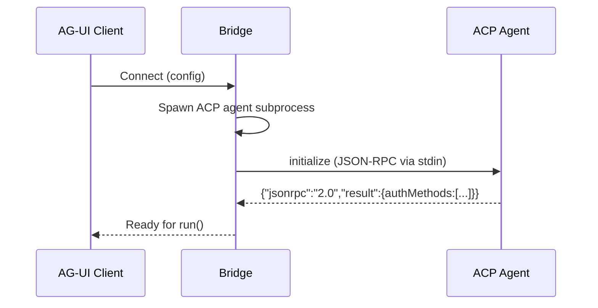
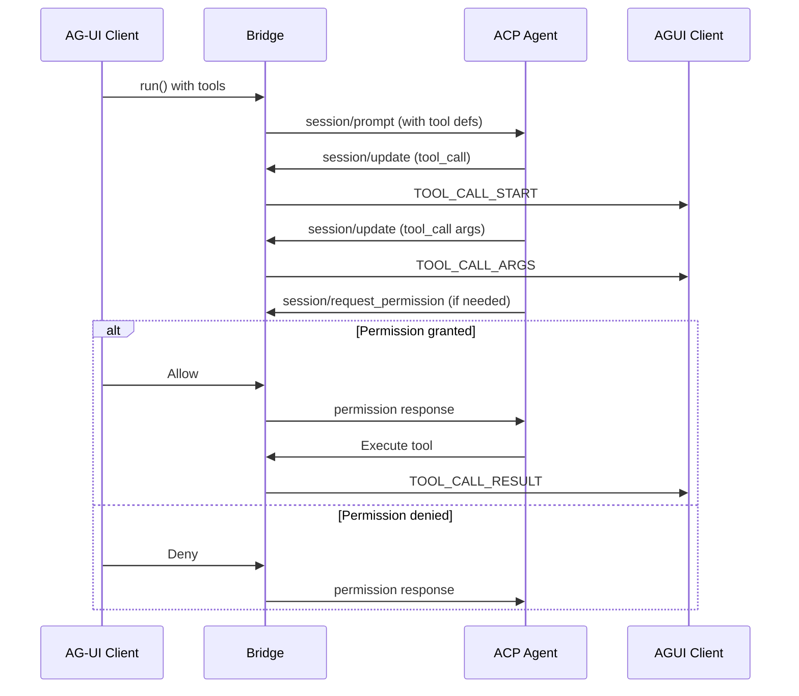

# AG-UI to ACP Bridge Specification

> Technical specification for bridging Agent User Interaction Protocol (AG-UI) to Agent Client Protocol (ACP)

## Executive Summary

The **AG-UI to ACP Bridge** enables AG-UI-compatible clients (web apps, React components, copilot interfaces) to connect to ACP-compatible agents (code editors, IDEs, CLI tools). It translates AG-UI's event-driven streaming architecture into ACP's JSON-RPC message flow, allowing AG-UI clients to leverage the ACP agent ecosystem.

**Direction:** `AG-UI Client → Bridge → ACP Agent`

---

## Feasibility Analysis

### Technical Feasibility: **High**

The bridge is technically feasible due to:

1. **Event-to-RPC Translation**
   - AG-UI events map naturally to ACP methods
   - AG-UI streaming patterns have ACP equivalents
   - Both use JSON as data format

2. **Session Model Mapping**
   - AG-UI `run(input)` with threadId → ACP `session/new` + `session/prompt`
   - ACP session IDs can be used as thread IDs
   - Message history maintained similarly

3. **Tool System Compatibility**
   - AG-UI tools defined in input → ACP tools via MCP or built-in
   - Tool call events → ACP tool_call updates
   - Tool results → AG-UI tool call result events

### Implementation Complexity: **Medium**

| Component | Complexity | Notes |
|-----------|------------|-------|
| Event to RPC | Low | Direct method mapping |
| Session lifecycle | Medium | Different session models |
| Tool definitions | Medium | Need to expose ACP tools |
| Streaming RPC | Medium | ACP is request-response, need to adapt |
| State sync | Low | AG-UI state → ACP session updates |

### Risks and Mitigations

| Risk | Mitigation |
|------|------------|
| ACP subprocess handling | Use stdio transport, manage process lifecycle |
| Tool permission flow | Map AG-UI tool handling to ACP session updates |
| No native streaming in ACP | Use session updates for incremental responses |
| Version negotiation | Handle via initialize exchange |

---

## Goals

### Primary Goals

1. **Bidirectional Interoperability**
   - Enable AG-UI clients to connect to any ACP-compatible agent
   - Leverage ACP agents from AG-UI-compatible UIs

2. **Tool Integration**
   - Expose ACP agent tools to AG-UI clients
   - Handle tool call lifecycle seamlessly

3. **Session Continuity**
   - Support conversation history across turns
   - Enable session resumption

### Secondary Goals

1. **Auth Integration**
   - Bridge AG-UI HTTP auth to ACP `authenticate` method
   
2. **Error Handling**
   - Translate ACP errors to AG-UI RUN_ERROR events

3. **State Sharing**
   - Map AG-UI state to ACP session context

---

## Features

### Core Features

#### 1. Connection Management

The bridge spawns and manages ACP agent subprocesses:

```typescript
interface BridgeConfig {
  agentCommand: string;      // Binary or npx command
  agentArgs?: string[];      // Additional arguments (e.g., ['acp'])
  agentEnv?: Record<string, string>;  // Environment variables
  workingDirectory?: string;
  
  // ACP handshake
  clientCapabilities: {
    fs?: { readTextFile?: boolean; writeTextFile?: boolean };
    terminal?: boolean;
    auth?: { terminal?: boolean };
  };
}
```

**Startup Flow:**


#### 2. Run Request Translation

**AG-UI Input:**
```typescript
interface RunAgentInput {
  threadId: string;
  runId: string;
  state?: Record<string, any>;
  messages: Message[];
  tools?: Tool[];
  context?: ContextItem[];
}
```

**ACP Translation:**
```typescript
async run(input: RunAgentInput): Promise<Observable<BaseEvent>> {
  // Get or create session
  const sessionId = await this.getOrCreateSession(input.threadId);
  
  // Convert messages
  const prompt = this.aguiMessagesToAcpPrompt(input.messages);
  
  // Send prompt
  return this.streamSessionUpdates(sessionId, prompt);
}
```

#### 3. Event Stream Generation

The bridge transforms ACP responses into AG-UI events:

```typescript
// ACP: session/update notifications
{
  "jsonrpc": "2.0",
  "method": "session/update",
  "params": {
    "sessionId": "sess_123",
    "update": {
      "sessionUpdate": "agent_message_chunk",
      "content": { "type": "text", "text": "Hello" }
    }
  }
}

// AG-UI: Event stream
{ "type": "TEXT_MESSAGE_START", "messageId": "msg_1", "role": "assistant" }
{ "type": "TEXT_MESSAGE_CONTENT", "messageId": "msg_1", "delta": "Hello" }
{ "type": "TEXT_MESSAGE_END", "messageId": "msg_1" }
```

#### 4. Tool Call Handling



**Tool Definition Translation:**
```typescript
// AG-UI tool
interface Tool {
  name: string;
  description: string;
  parameters: JSONSchema;
}

// ACP: Tools are typically via MCP, but we can expose via prompt
// The bridge translates AG-UI tools to MCP tool definitions if needed
```

#### 5. Session Management

```typescript
class AguiToAcpBridge {
  private sessions: Map<string, string>;  // threadId -> sessionId
  
  async getOrCreateSession(threadId: string): Promise<string> {
    if (this.sessions.has(threadId)) {
      return this.sessions.get(threadId);
    }
    
    // Create new ACP session
    const response = await this.acp.request('session/new', {
      cwd: this.config.workingDirectory,
      mcpServers: this.config.mcpServers ?? []
    });
    
    const sessionId = response.result.sessionId;
    this.sessions.set(threadId, sessionId);
    
    return sessionId;
  }
  
  async loadSession(threadId: string, sessionId: string): Promise<void> {
    // For session resumption
    await this.acp.request('session/load', {
      sessionId,
      cwd: this.config.workingDirectory,
      mcpServers: []
    });
    
    this.sessions.set(threadId, sessionId);
  }
}
```

---

## Architecture

### Component Diagram

```
┌──────────────┐     ┌─────────────────┐     ┌──────────────┐
│  AG-UI       │────▶│  AGUI-ACP Bridge│────▶│  ACP Agent  │
│  Client      │◀────│                 │◀────│  (subprocess)│
└──────────────┘     └─────────────────┘     └──────────────┘
                           │
                    ┌──────┴──────┐
                    │  Core Logic │
                    ├─────────────┤
                    │ • ACP Proc  │
                    │ • Session   │
                    │ • Translator│
                    │ • Events    │
                    └─────────────┘
```

### Class Structure

```typescript
import { EventEmitter } from 'events';

class AguiToAcpBridge extends EventEmitter {
  private agentProcess: ChildProcess;
  private sessions: Map<string, string>;
  private config: BridgeConfig;
  
  constructor(config: BridgeConfig) {
    super();
    this.config = config;
    this.sessions = new Map();
  }
  
  // Connection lifecycle
  async connect(): Promise<void> {
    this.agentProcess = spawn(
      this.config.agentCommand,
      this.config.agentArgs ?? ['acp'],
      {
        stdio: ['pipe', 'pipe', 'pipe'],
        env: { ...process.env, ...this.config.agentEnv },
        cwd: this.config.workingDirectory
      }
    );
    
    // Initialize ACP
    const initResponse = await this.sendRequest('initialize', {
      protocolVersion: 1,
      clientCapabilities: this.config.clientCapabilities,
      clientInfo: { name: 'agui-bridge', version: '1.0.0' }
    });
    
    // Handle auth if needed
    if (initResponse.result.authMethods?.length > 0) {
      await this.handleAuthentication(initResponse.result.authMethods);
    }
  }
  
  // Main entry point - run agent
  run(input: RunAgentInput): Observable<BaseEvent> {
    return new Observable(observer => {
      this.executeRun(input, observer);
    });
  }
  
  private async executeRun(
    input: RunAgentInput, 
    observer: Observer<BaseEvent>
  ): Promise<void> {
    const sessionId = await this.getOrCreateSession(input.threadId);
    
    // Emit run started
    observer.next({
      type: EventType.RUN_STARTED,
      threadId: input.threadId,
      runId: input.runId
    });
    
    // Convert AG-UI messages to ACP prompt format
    const prompt = this.convertMessages(input.messages);
    
    // Send prompt and stream updates
    await this.streamSessionUpdates(sessionId, prompt, observer);
    
    // Emit run finished
    observer.next({
      type: EventType.RUN_FINISHED,
      threadId: input.threadId,
      runId: input.runId
    });
    
    observer.complete();
  }
  
  private async streamSessionUpdates(
    sessionId: string, 
    prompt: ContentBlock[],
    observer: Observer<BaseEvent>
  ): Promise<void> {
    // Send prompt request
    await this.sendRequest('session/prompt', {
      sessionId,
      prompt
    });
    
    // Note: ACP sends updates via notifications
    // The bridge listens and translates
  }
  
  // ACP notification handler
  private handleSessionUpdate(update: SessionUpdate): void {
    switch (update.sessionUpdate) {
      case 'agent_message_chunk':
        this.emitTextMessage(update.content);
        break;
      case 'tool_call':
        this.emitToolCallStart(update);
        break;
      case 'tool_call_update':
        this.emitToolCallResult(update);
        break;
      case 'plan':
        this.emitAgentPlan(update.entries);
        break;
    }
  }
  
  async disconnect(): Promise<void> {
    // Clean up sessions
    this.sessions.clear();
    
    // Kill agent process
    this.agentProcess?.kill();
  }
}
```

---

## Message Mapping Reference

### AG-UI Events to ACP Methods

| AG-UI Input | ACP Method | Notes |
|-------------|------------|-------|
| `run()` | `session/new` + `session/prompt` | Session creation + prompt |
| `threadId` mapping | `sessionId` | 1:1 mapping |
| `tools` in input | Via MCP in `session/new` | Agent tools come from MCP |

### ACP Notifications to AG-UI Events

| ACP Notification | AG-UI Event |
|-----------------|-------------|
| `sessionUpdate: "agent_message_chunk"` | `TEXT_MESSAGE_*` |
| `sessionUpdate: "tool_call"` | `TOOL_CALL_START`, `TOOL_CALL_ARGS` |
| `sessionUpdate: "tool_call_update"` | `TOOL_CALL_RESULT` |
| `sessionUpdate: "plan"` | Custom event or `STATE_SNAPSHOT` |
| `sessionUpdate: "available_commands_update"` | Custom event |

### Error Mapping

| ACP Error | AG-UI Event |
|----------|-------------|
| `auth_required` | 401 response or auth flow |
| `protocol_version_mismatch` | `RUN_ERROR` with code |
| Tool execution failure | `TOOL_CALL_RESULT` with error |

---

## Configuration

```typescript
interface AguiToAcpBridgeConfig {
  // Agent specification
  agent: {
    command: string;           // 'npx', 'uvx', or '/path/to/binary'
    args?: string[];           // ['agent-name', '--acp']
    env?: Record<string, string>;
    cwd?: string;
    mcpServers?: McpServer[];
  };
  
  // Client capabilities to advertise to agent
  capabilities: {
    fs?: { readTextFile?: boolean; writeTextFile?: boolean };
    terminal?: boolean;
  };
  
  // Behavior options
  options: {
    autoAuthenticate?: boolean;  // Auto-handle auth
    streamToolCalls?: boolean;   // Stream tool call progress
    includePlanning?: boolean;   // Forward plan updates
  };
}
```

---

## Usage Example

```typescript
import { AguiToAcpBridge } from './bridge';
import { EventType } from '@ag-ui/core';

// Create bridge
const bridge = new AguiToAcpBridge({
  agent: {
    command: 'npx',
    args: ['@agentclientprotocol/claude-agent-acp', '--acp'],
    cwd: '/project'
  },
  capabilities: {
    fs: { readTextFile: true, writeTextFile: true }
  }
});

// Connect
await bridge.connect();

// Run agent
const stream = bridge.run({
  threadId: 'thread_123',
  runId: 'run_456',
  state: {},
  messages: [
    { id: 'msg_1', role: 'user', content: 'Hello, help me with code' }
  ],
  tools: [],
  context: []
});

// Subscribe to events
stream.subscribe({
  next(event) {
    switch (event.type) {
      case EventType.TEXT_MESSAGE_CONTENT:
        console.log('AI:', event.delta);
        break;
      case EventType.TOOL_CALL_START:
        console.log('Tool call:', event.toolCallName);
        break;
      case EventType.RUN_FINISHED:
        console.log('Run complete');
        break;
    }
  },
  error(err) {
    console.error('Error:', err);
  },
  complete() {
    console.log('Stream done');
  }
});

// Cleanup
await bridge.disconnect();
```

---

## Limitations

| Feature | Status | Notes |
|---------|--------|-------|
| Binary transport | Not supported | ACP stdio only |
| MCP dynamically | Limited | Configured at startup |
| Terminal UI | Not supported | Requires terminal capability |
| Session modes | Not mapped | ACP-specific |
| Permission UI | Basic | Simple allow/deny |

---

## References

- [ACP Protocol](./acp.md)
- [AG-UI Protocol](./agui.md)
- [ACP Registry](./acp-registry.md)
- [AG-UI Server Quickstart](https://docs.ag-ui.com/quickstart/server.md)