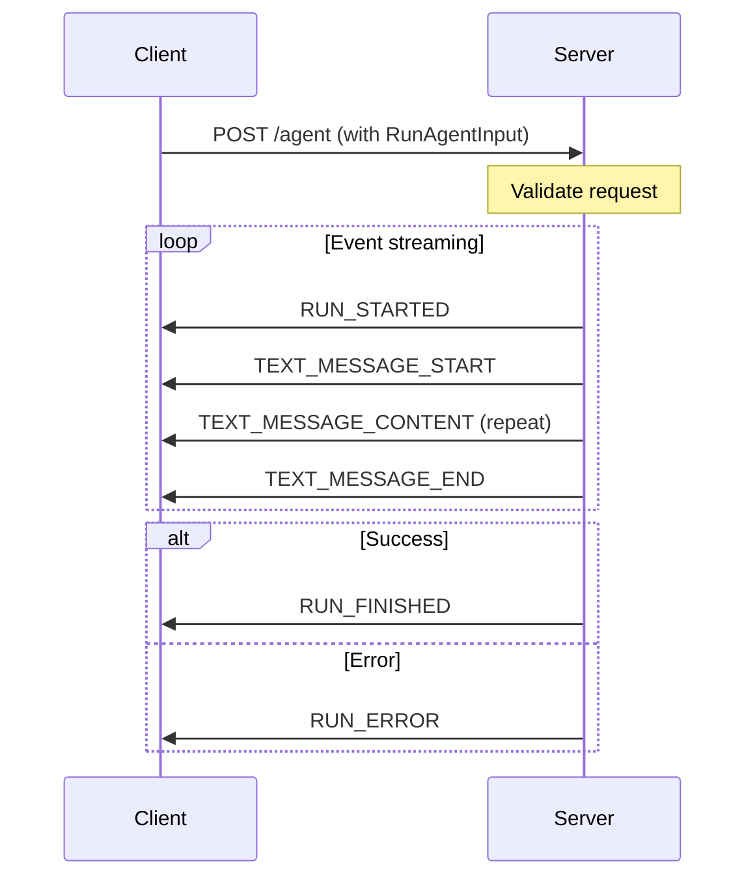
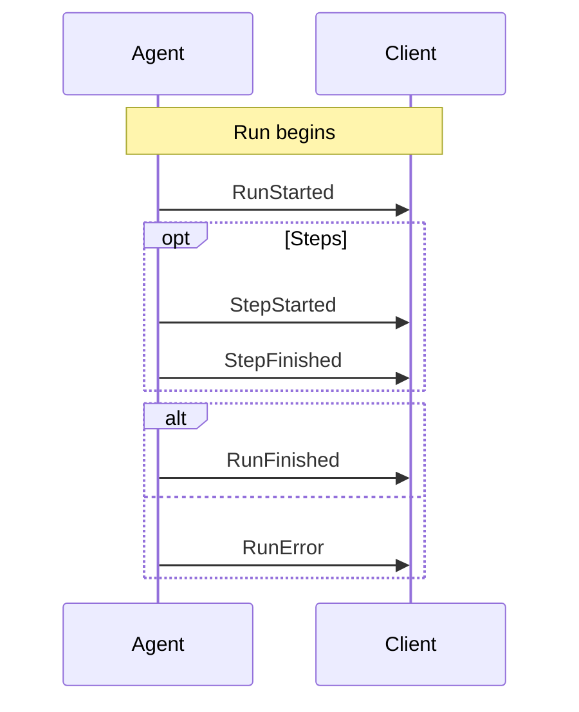
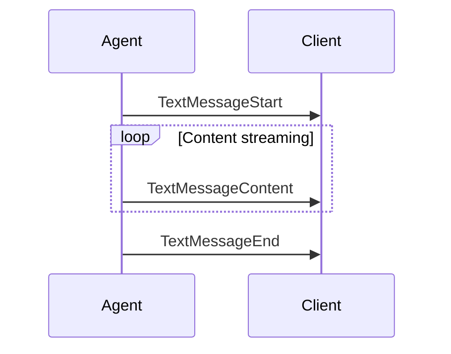
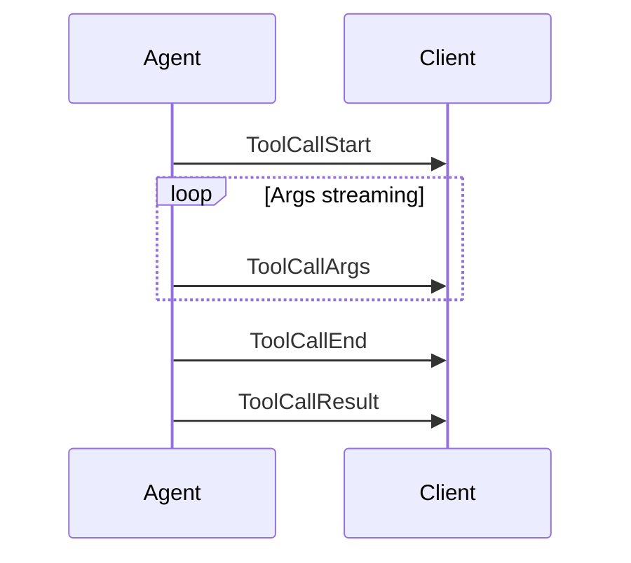
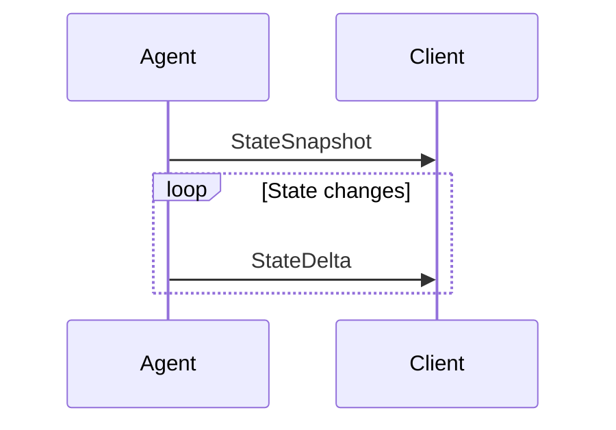
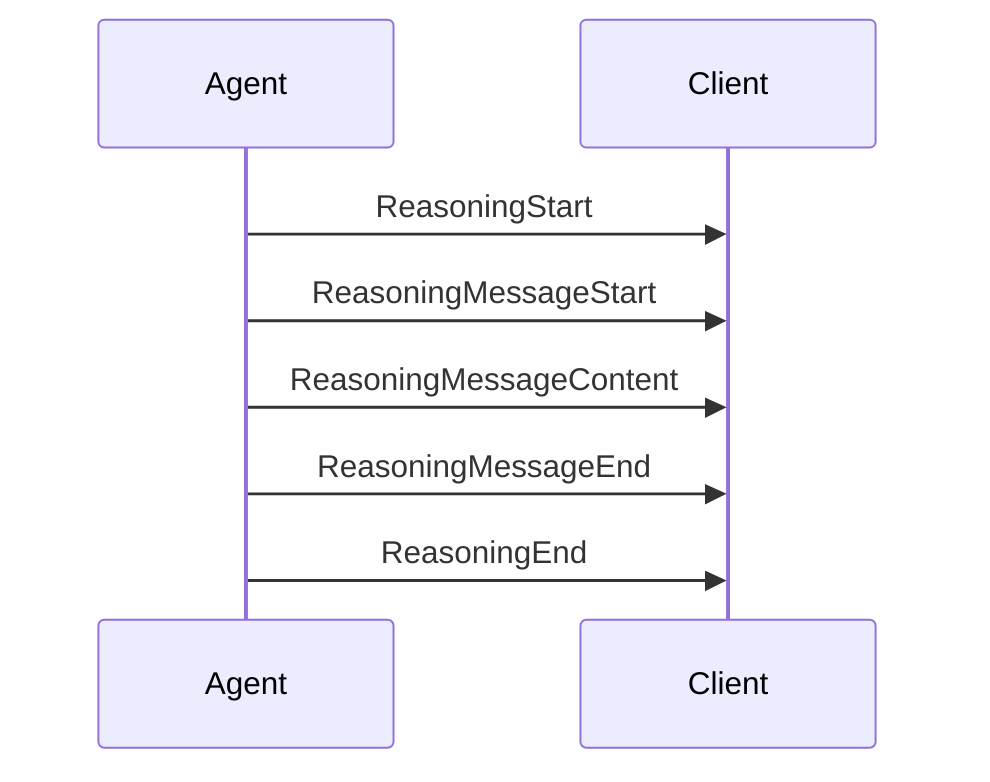

# Agent User Interaction Protocol (AG-UI)

> A protocol for connecting front-end applications to AI agents with event-driven streaming

**Website:** https://docs.ag-ui.com

## Overview

The Agent User Interaction Protocol (AG-UI) is built on a flexible, event-driven architecture that enables seamless communication between front-end applications and AI agents. It is designed to be:

- **Lightweight and minimally opinionated**: Easy to integrate with various agent implementations
- **Transport agnostic**: Supports SSE, WebSockets, webhooks, and more
- **Event-driven**: Uses 16 standardized event types for real-time updates

## Architecture

```
┌─────────────────┐     ┌─────────────┐     ┌─────────────────┐
│   Application   │────▶│  AG-UI      │────▶│     AI Agent    │
│   (Frontend)    │◀────│  Client     │◀────│   (Backend)     │
└─────────────────┘     └─────────────┘     └─────────────────┘
```

### Components

- **Application**: User-facing apps (chat, AI-enabled applications)
- **AG-UI Client**: Generic communication clients like `HttpAgent`
- **Agents**: Backend AI agents that process requests and generate streaming responses

## Core Concepts

### Protocol Layer

The primary abstraction is the `run(input: RunAgentInput) -> Observable<BaseEvent>` interface:

```typescript
class MyAgent extends AbstractAgent {
  run(input: RunAgentInput): RunAgent {
    const { threadId, runId } = input
    return () => from([
      { type: EventType.RUN_STARTED, threadId, runId },
      { type: EventType.MESSAGES_SNAPSHOT, messages: [...] },
      { type: EventType.RUN_FINISHED, threadId, runId },
    ])
  }
}
```

## Transport Mechanisms

AG-UI is transport-agnostic, supporting multiple mechanisms for delivering event streams.

### HTTP SSE (Server-Sent Events)

The most common transport for browser compatibility:

**Request Format:**
```http
POST /agent HTTP/1.1
Content-Type: application/json
Accept: text/event-stream

{
  "threadId": "thread_123",
  "runId": "run_456",
  "state": {},
  "messages": [...],
  "tools": [...],
  "context": []
}
```

**Response Format (SSE):**
```http
HTTP/1.1 200 OK
Content-Type: text/event-stream

event: event
data: {"type":"RUN_STARTED","threadId":"thread_123","runId":"run_456"}

event: event
data: {"type":"TEXT_MESSAGE_START","messageId":"msg_1","role":"assistant"}

event: event
data: {"type":"TEXT_MESSAGE_CONTENT","messageId":"msg_1","delta":"Hello"}

event: event
data: {"type":"TEXT_MESSAGE_END","messageId":"msg_1"}

event: event
data: {"type":"RUN_FINISHED","threadId":"thread_123","runId":"run_456"}
```

**SSE Framing:**
- `event: event` line marks an event
- `data:` followed by JSON payload
- Double newline (`\n\n`) separates events

### HTTP Binary Protocol

Space-efficient binary serialization for production:

**Content-Type:** `application/x-ag-ui-binary` (or `application/octet-stream`)

**Encoding:**
- Uses Protocol Buffers for event serialization
- More performant than SSE for high-volume scenarios
- Requires client-side decoding

**Request:**
```http
POST /agent HTTP/1.1
Content-Type: application/json
Accept: application/x-ag-ui-binary

{...}
```

### WebSocket Transport

For bidirectional, persistent connections:

```typescript
const ws = new WebSocket('wss://your-agent.com/agent');

ws.onmessage = (event) => {
  const agEvent = JSON.parse(event.data);
  // Handle event
};

ws.send(JSON.stringify({
  type: "RUN_AGENT",
  threadId: "thread_123",
  runId: "run_456",
  messages: [...]
}));
```

### Webhook Transport

For server-to-server, event-driven scenarios:

```typescript
// Server registers webhook
POST /webhooks/register
{
  "url": "https://my-server.com/webhook",
  "events": ["RUN_STARTED", "RUN_FINISHED", "TEXT_MESSAGE_CONTENT"]
}

// Agent sends events to webhook
POST https://my-server.com/webhook
{
  "type": "TEXT_MESSAGE_CONTENT",
  "messageId": "msg_1",
  "delta": "Hello"
}
```

### Transport Comparison

| Transport | Use Case | Pros | Cons |
|-----------|----------|------|------|
| SSE | Browser clients | Native browser support, simple | Text overhead |
| Binary | High-volume | Efficient, compact | Requires decoder |
| WebSocket | Real-time bidirectional | Persistent connection | More complex |
| Webhook | Server-to-server | Async, decoupled | No direct response |

### Content Negotiation

AG-UI uses `Accept` header to negotiate transport:

```http
Accept: text/event-stream      # SSE
Accept: application/x-ag-ui-binary  # Binary
Accept: */*                    # Server chooses
```

The `EventEncoder` class handles this automatically:

```python
encoder = EventEncoder(accept=request.headers.get("accept"))
return StreamingResponse(
    event_generator(),
    media_type=encoder.get_content_type()
)
```

### Transport Connection Lifecycle



### Transport Error Handling

**Connection Errors:**
- Network failure: Client should implement retry with exponential backoff
- Server timeout: SSE connections may timeout, client reconnects

**Protocol Errors:**
- Invalid event format: Log and continue (don't crash stream)
- Missing required fields: Emit RUN_ERROR event

**Server-Side Error Handling:**
```python
try:
    # Process request
    yield encoder.encode(RunStartedEvent(...))
    # ... more events
except Exception as error:
    yield encoder.encode(RunErrorEvent(
        type=EventType.RUN_ERROR,
        message=str(error)
    ))
```

**Client-Side Error Handling:**
```typescript
agent.runAgent({...}).subscribe({
  next: (event) => { /* handle event */ },
  error: (error) => { 
    // Transport-level error (network, etc.)
    console.error("Connection error:", error);
  },
  complete: () => { /* stream ended */ }
});
```

## Error Handling

AG-UI handles errors at multiple levels: transport, protocol, and application.

### Error Event Types

**RunError** - Signals error during agent run:
```typescript
{ 
  type: "RUN_ERROR", 
  message: "Error message", 
  code?: string  // Optional error code for categorization
}
```

**Error codes (convention):**
- `AUTHENTICATION_ERROR`: Auth failed
- `TOOL_ERROR`: Tool execution failed
- `VALIDATION_ERROR`: Invalid input
- `INTERNAL_ERROR`: Server error
- `TIMEOUT_ERROR`: Operation timed out

### Error Handling in Server Implementation

```python
async def agentic_chat_endpoint(input_data: RunAgentInput, request: Request):
    try:
        yield encoder.encode(RunStartedEvent(...))
        # ... process
        yield encoder.encode(RunFinishedEvent(...))
    except AuthenticationError as e:
        yield encoder.encode(RunErrorEvent(
            type=EventType.RUN_ERROR,
            message=str(e),
            code="AUTHENTICATION_ERROR"
        ))
    except ToolError as e:
        yield encoder.encode(RunErrorEvent(
            type=EventType.RUN_ERROR,
            message=str(e),
            code="TOOL_ERROR"
        ))
    except Exception as e:
        yield encoder.encode(RunErrorEvent(
            type=EventType.RUN_ERROR,
            message=str(e),
            code="INTERNAL_ERROR"
        ))
```

### Error Handling in Client

```typescript
agent.runAgent({
  tools: [...],
  messages: [...]
}).subscribe({
  next: (event) => {
    switch(event.type) {
      case EventType.RUN_ERROR:
        // Display error to user
        displayError(event.message, event.code);
        break;
      case EventType.TEXT_MESSAGE_CONTENT:
        // Display message
        break;
    }
  },
  error: (transportError) => {
    // Connection-level error
    // Implement retry logic
    retryWithBackoff();
  }
});
```

### Tool Call Errors

Tool execution errors are communicated through the event stream:

```typescript
// Tool execution fails
{ 
  type: "TOOL_CALL_RESULT",
  toolCallId: "call_001",
  content: "Error: API rate limit exceeded",
  error: "rate_limit"  // Error indicator
}
```

The tool result message includes an `error` field for failure scenarios.

### State Synchronization Errors

If state deltas fail to apply:

```typescript
// Client-side handling
try {
  applyPatch(state, delta);
} catch (e) {
  // Request fresh snapshot
  requestStateSnapshot();
}
```

### Best Practices

**Server-side:**
- Always emit RUN_ERROR instead of crashing the stream
- Include meaningful error messages
- Use error codes for programmatic handling

**Client-side:**
- Distinguish transport errors from RUN_ERROR events
- Implement retry logic for transient failures
- Display RUN_ERROR to users appropriately
- Preserve error state for debugging

### Retry Strategy

For transient errors (network, timeout):

```typescript
async function runWithRetry(agent, input, maxRetries = 3) {
  for (let attempt = 0; attempt < maxRetries; attempt++) {
    try {
      return await firstValueFrom(agent.runAgent(input));
    } catch (error) {
      if (attempt === maxRetries - 1) throw error;
      await delay(Math.pow(2, attempt) * 1000); // Exponential backoff
    }
  }
}
```

## Events System

All communication in AG-UI is based on typed events. Every event inherits from:

```typescript
interface BaseEvent {
  type: EventType
  timestamp?: number
  rawEvent?: any
}
```

### Event Categories

| Category | Purpose |
|----------|---------|
| Lifecycle Events | Monitor progression of agent runs |
| Text Message Events | Handle streaming textual content |
| Tool Call Events | Manage tool executions |
| State Management Events | Synchronize state between agent and UI |
| Activity Events | Represent ongoing activity progress |
| Special Events | Support custom functionality |

### Lifecycle Events



**RunStarted** - Signals start of an agent run:
```typescript
{ type: "RUN_STARTED", threadId: "thread_123", runId: "run_456" }
```

**RunFinished** - Signals successful completion:
```typescript
{ type: "RUN_FINISHED", threadId: "thread_123", runId: "run_456", result?: any }
```

**RunError** - Signals error:
```typescript
{ type: "RUN_ERROR", message: "Error message", code?: string }
```

**StepStarted/StepFinished** - Signals step boundaries (optional):
```typescript
{ type: "STEP_STARTED", stepName: "analyze_code" }
{ type: "STEP_FINISHED", stepName: "analyze_code" }
```

### Text Message Events

Follow a streaming pattern:



```typescript
// Start
{ type: "TEXT_MESSAGE_START", messageId: "msg_123", role: "assistant" }

// Content chunks (delta = text to append)
{ type: "TEXT_MESSAGE_CONTENT", messageId: "msg_123", delta: "Hello" }
{ type: "TEXT_MESSAGE_CONTENT", messageId: "msg_123", delta: " world" }

// End
{ type: "TEXT_MESSAGE_END", messageId: "msg_123" }
```

**TextMessageChunk** - Convenience event that auto-expands to Start → Content → End

### Tool Call Events

Follow a streaming pattern similar to text:



```typescript
// Start
{ type: "TOOL_CALL_START", toolCallId: "call_001", toolCallName: "getWeather" }

// Args chunks (JSON fragments)
{ type: "TOOL_CALL_ARGS", toolCallId: "call_001", delta: '{"loc' }
{ type: "TOOL_CALL_ARGS", toolCallId: "call_001", delta: 'ation": "NYC"' }

// End
{ type: "TOOL_CALL_END", toolCallId: "call_001" }

// Result
{ type: "TOOL_CALL_RESULT", toolCallId: "call_001", content: "..." }
```

**ToolCallChunk** - Convenience event that auto-expands to Start → Args → End

### State Management Events



**StateSnapshot** - Complete state at a point in time:
```typescript
{ type: "STATE_SNAPSHOT", snapshot: { key: "value", ... } }
```

**StateDelta** - Incremental updates using JSON Patch (RFC 6902):
```typescript
{ type: "STATE_DELTA", delta: [
  { "op": "add", "path": "/user/preferences", "value": { "theme": "dark" } },
  { "op": "replace", "path": "/counter", "value": 42 }
]}
```

**MessagesSnapshot** - Complete conversation history:
```typescript
{ type: "MESSAGES_SNAPSHOT", messages: [...] }
```

### Activity Events

Expose structured, in-progress activity updates (PLAN, SEARCH, etc.):

```typescript
// Snapshot
{ type: "ACTIVITY_SNAPSHOT", messageId: "msg_123", activityType: "PLAN", content: {...} }

// Delta
{ type: "ACTIVITY_DELTA", messageId: "msg_123", activityType: "PLAN", patch: [...] }
```

### Reasoning Events

Support LLM reasoning visibility and chain-of-thought:



```typescript
{ type: "REASONING_START", messageId: "reasoning_1" }
{ type: "REASONING_MESSAGE_START", messageId: "reasoning_1", role: "reasoning" }
{ type: "REASONING_MESSAGE_CONTENT", messageId: "reasoning_1", delta: "Analyzing..." }
{ type: "REASONING_MESSAGE_END", messageId: "reasoning_1" }
{ type: "REASONING_END", messageId: "reasoning_1" }
```

**ReasoningEncryptedValue** - Encrypted chain-of-thought for privacy:
```typescript
{
  type: "REASONING_ENCRYPTED_VALUE",
  subtype: "message" | "tool-call",
  entityId: "msg_123",
  encryptedValue: "..."
}
```

### Special Events

**Raw** - Pass through events from external systems:
```typescript
{ type: "RAW", event: {...}, source?: "external-system" }
```

**Custom** - Application-specific custom events:
```typescript
{ type: "CUSTOM", name: "myEvent", value: {...} }
```

## Messages

AG-UI messages follow a vendor-neutral format:

```typescript
interface BaseMessage {
  id: string
  role: "user" | "assistant" | "system" | "tool" | "developer" | "activity" | "reasoning"
  content?: string
  name?: string
  encryptedContent?: string
}
```

### User Messages

```typescript
interface UserMessage {
  id: string
  role: "user"
  content: string | InputContent[]
  name?: string
}

type InputContent = TextInputContent | ImageInputContent | AudioInputContent | VideoInputContent | DocumentInputContent
```

### Assistant Messages

```typescript
interface AssistantMessage {
  id: string
  role: "assistant"
  content?: string
  toolCalls?: ToolCall[]
  encryptedContent?: string
}
```

### Tool Messages

```typescript
interface ToolMessage {
  id: string
  role: "tool"
  content: string
  toolCallId: string
  error?: string
  encryptedValue?: string
}
```

## Running Agents

```typescript
const agent = new HttpAgent({
  url: "https://your-agent-endpoint.com/agent",
  agentId: "unique-agent-id",
  threadId: "conversation-thread"
});

agent.runAgent({
  tools: [...],
  context: [...]
}).subscribe({
  next: (event) => {
    switch(event.type) {
      case EventType.TEXT_MESSAGE_CONTENT:
        // Update UI
        break;
      case EventType.TOOL_CALL_START:
        // Show tool call
        break;
    }
  },
  error: (error) => console.error("Agent error:", error),
  complete: () => console.log("Agent run complete")
});
```

## Tools

Tools are defined in the frontend and passed to the agent:

```typescript
const tool = {
  name: "getWeather",
  description: "Get weather for a location",
  parameters: {
    type: "object",
    properties: {
      location: { type: "string", description: "City name" },
      unit: { type: "string", enum: ["celsius", "fahrenheit"] }
    },
    required: ["location"]
  }
}
```

Frontend-defined tools allow:
- Frontend control over available capabilities
- Dynamic capability based on user permissions
- Security through application-controlled implementations

## State Management

AG-UI provides efficient state synchronization through:
- **STATE_SNAPSHOT**: Complete state at a point in time
- **STATE_DELTA**: Incremental JSON Patch updates
- **MESSAGES_SNAPSHOT**: Complete conversation history

This enables efficient client-side state management with minimal data transfer.

## Middleware

AG-UI includes a middleware layer that:
- Supports flexible event structure (events don't need to match AG-UI format exactly)
- Is transport agnostic (SSE, WebSockets, webhooks, etc.)

Middleware allows existing agent frameworks to adapt with minimal effort.

## Authentication

AG-UI is transport-agnostic, so authentication is handled at the HTTP layer rather than within the protocol itself. This differs from ACP's integrated auth model.

### HTTP-Based Authentication

Since AG-UI typically runs over HTTP, authentication uses standard HTTP mechanisms:

**API Key Authentication:**
```http
POST /agent HTTP/1.1
Authorization: Bearer sk-xxxxx
Content-Type: application/json

{ "threadId": "...", ... }
```

**Custom Headers:**
```http
POST /agent HTTP/1.1
X-API-Key: your-api-key
X-Custom-Auth: token-value
Content-Type: application/json

{ ... }
```

### RunAgentInput for Authentication Context

The `RunAgentInput` can include authentication-related context:

```typescript
interface RunAgentInput {
  threadId: string
  runId: string
  state?: Record<string, any>
  messages: Message[]
  tools?: Tool[]
  context?: ContextItem[]
  forwardedProps?: Record<string, any>
}
```

The `forwardedProps` field can carry authentication tokens or session data from the frontend to the agent server.

### Server-Side Auth Middleware

AG-UI servers implement auth via middleware or request validation:

```typescript
// Example: Express middleware
app.post('/agent', async (req, res, next) => {
  const authHeader = req.headers.authorization;
  
  if (!authHeader) {
    return res.status(401).json({ 
      error: { code: 'AUTHENTICATION_ERROR', message: 'Missing authorization' }
    });
  }
  
  const token = authHeader.replace('Bearer ', '');
  const valid = await validateToken(token);
  
  if (!valid) {
    return res.status(401).json({ 
      error: { code: 'AUTHENTICATION_ERROR', message: 'Invalid token' }
    });
  }
  
  next();
});
```

### Auth Error Responses

Server returns authentication errors as HTTP responses:

```http
HTTP/1.1 401 Unauthorized
Content-Type: application/json

{
  "error": {
    "code": "AUTHENTICATION_ERROR",
    "message": "Invalid or expired API key"
  }
}
```

### Client-Side Auth Handling

```typescript
const agent = new HttpAgent({
  url: "https://your-agent.com/agent",
  headers: {
    "Authorization": `Bearer ${apiKey}`
  }
});

agent.runAgent({...}).subscribe({
  error: (error) => {
    if (error.status === 401) {
      // Handle auth failure - prompt user for new credentials
      promptForNewCredentials();
    }
  }
});
```

### Comparing ACP vs AG-UI Auth

| Aspect | ACP | AG-UI |
|--------|-----|-------|
| Auth location | Protocol level (authenticate method) | Transport level (HTTP headers) |
| Method discovery | `authMethods` in initialize response | Custom (server-defined) |
| Flow | Client calls `authenticate` before session | HTTP auth on each request |
| Session-based | Yes (auth persists for session) | Depends on implementation |

AG-UI relies on the underlying HTTP transport for authentication, making it flexible but requiring server-side implementation of auth logic.

## Relationship with Other Protocols

See [MCP, A2A, and AG-UI](https://docs.ag-ui.com/agentic-protocols.md) for how AG-UI complements:
- **MCP (Model Context Protocol)**: Tool and resource access
- **A2A (Agent-to-Agent)**: Agent-to-agent communication

## SDKs

| Language | Package |
|----------|---------|
| TypeScript | `@ag-ui/client`, `@ag-ui/core` |
| Python | `ag-ui` |

---

**References:**
- [AG-UI Documentation](https://docs.ag-ui.com)
- [Core Architecture](https://docs.ag-ui.com/concepts/architecture)
- [Events](https://docs.ag-ui.com/concepts/events)
- [Messages](https://docs.ag-ui.com/concepts/messages)
- [Tools](https://docs.ag-ui.com/concepts/tools)
- [State Management](https://docs.ag-ui.com/concepts/state)
- [Reasoning](https://docs.ag-ui.com/concepts/reasoning)
- [MCP, A2A, and AG-UI](https://docs.ag-ui.com/agentic-protocols)